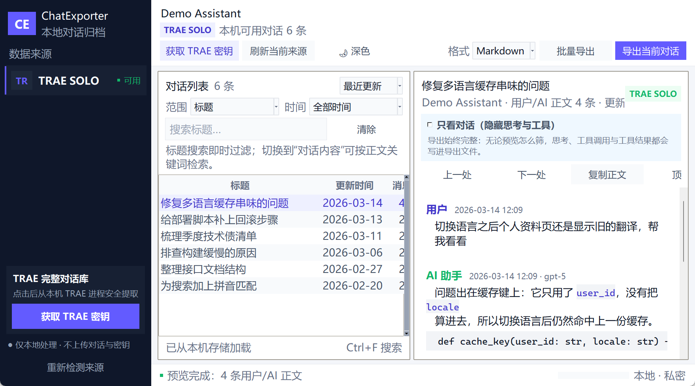
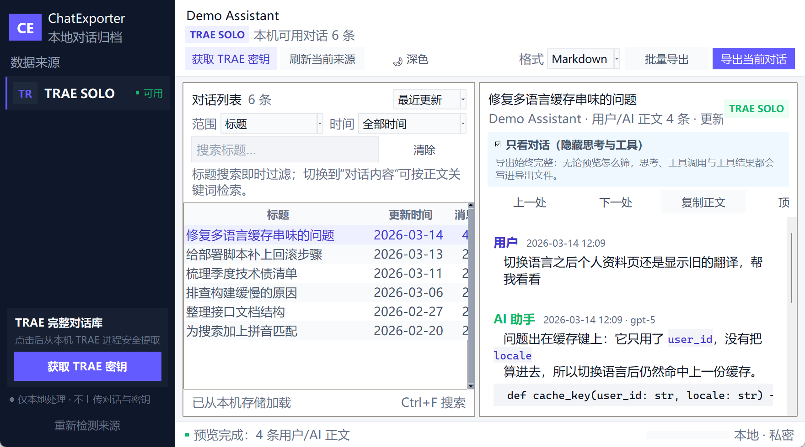
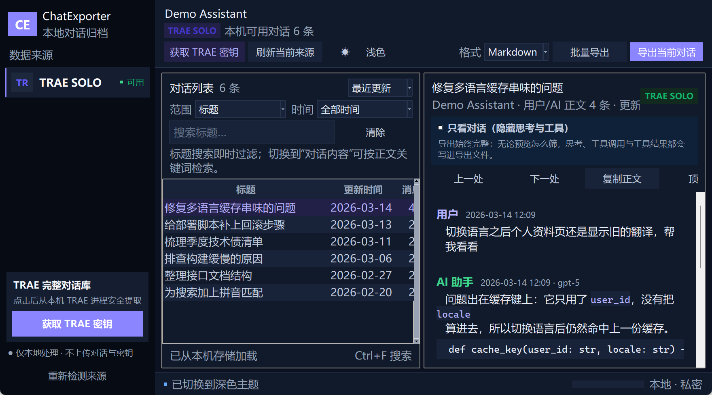

# ChatExporter

**把散落在各个 AI 客户端里的对话，完整地存到你自己手里。**

[](https://github.com/fanchen621/ChatExporter/actions/workflows/ci.yml)
[](LICENSE)
[](#安装)
[](#从源码运行)

ChatExporter 是一款 **本地优先** 的桌面工具：读取本机多个 AI 助手客户端的对话记录，
提供检索和阅读，并导出为 Markdown / HTML / JSON / 纯文本。
对话和密钥全程留在你自己的电脑上，不上传、不联网、不依赖任何云服务。



---

## 为什么需要它

AI 客户端把你的对话锁在各自的私有数据库里。换个工具、清个缓存、重装个系统，几个月的
思路和结论就没了。ChatExporter 做的事很简单：**把它们完整地拿出来，变成你能长期保存、
能全文检索、能随时读的文件。**

关键词是 **完整**。这不是一句口号——为了做到它，本项目在真实数据上逐条核对过：

| 曾经的问题 | 后果 | 现状 |
|---|---|---|
| 工具输出被当作"预览噪声"过滤掉 | 实测一条对话 **97% 的字节** 没进导出 | 完整保留，默认折叠 |
| 未闭合的内部标签吞掉后续正文 | 消息剩余内容静默消失 | 整词匹配 + 闭合配对才跳过 |
| 用户自己写的 `Shell:` `Path:` 开头的行被当环境噪声 | 真实提问被整行删除 | 仅在确有注入上下文时清理 |
| 批量导出读取失败仍写文件并计成功 | 空壳文件，你不知道丢了什么 | 逐条报告失败原因 |
| 只导出对话数最多的那一个账号库 | 其他账号的记录彻底不可见 | 覆盖全部账号库 |

每一条都有对应的回归测试。**117 个测试**，覆盖上述每一个缺陷。

---

## 功能

### 多来源

支持 TRAE SOLO CN、QoderWork CN、WorkBuddy、QClaw、腾讯 Marvis。
不同客户端的存储形态差异很大（SQLite / JSONL / SQLCipher 加密库），适配层负责把它们
归一成同一套消息模型。

### 完整导出，四种格式

| 格式 | 用途 |
|---|---|
| **Markdown** | 完整存档：正文、思考过程、工具调用、工具结果、代码块、附件 |
| **HTML** | 自包含单文件，可直接分享；深浅色自适应，内容严格转义 |
| **JSON** | 无损结构化，字段级还原，方便二次处理 |
| **纯文本** | 只留问答正文，最干净的阅读版 |

单条导出、多选导出、整个来源批量导出都支持，失败项会逐条列出。

### 阅读体验

预览默认只展示用户与 AI 的正文；勾选 **「只看对话」** 后进一步隐藏思考与工具记录。

这个开关的实现值得一提：不同客户端存储"回答"的方式不一样。有些客户端（如 TRAE）
**从不写入独立的回答字段**——AI 的输出整个存在推理里。所以简单地"隐藏思考"会让 AI
在阅读视图里彻底失声，只剩用户自己在说话。ChatExporter 按整段对话的实际形态自适应：

- AI 在任何一轮给过真正的回答正文 → 纯机器轮次整条隐藏
- AI 从头到尾没有回答正文 → 保留每轮最后一块推理作为结论

实测效果：一条 TRAE 对话的阅读视图从 242 万字符降到 5.7 万，**而 AI 一句话都没少**。

**无论预览怎么筛，导出文件永远是完整的。**



### 检索

- **标题检索**：即时过滤
- **全文检索**：按用户/AI 正文关键词搜索，结果按 `(来源, 对话, 更新戳)` 落盘缓存，
  跨会话复用，源数据变了自动失效
- **时间范围**：今天 / 近 7 天 / 30 天 / 90 天 / 一年

### 界面

深浅双主题即时切换、可拖拽分栏、代码块与行内代码等宽高亮、高 DPI 自适应中文排版。
窗口大小、分栏位置、上次来源、导出格式都会记住。



---

## 安装

### 下载

从 [Releases](https://github.com/fanchen621/ChatExporter/releases) 下载 `ChatExporter.exe`，
双击运行。无需安装，无需 Python 环境。

### 从源码运行

```bash
git clone https://github.com/fanchen621/ChatExporter.git
cd ChatExporter
pip install -r requirements.txt
python main.py
```

需要 Python 3.10+。界面基于 tkinter（Python 自带），运行期唯一的第三方依赖是
`cryptography`，用于解密 TRAE 的 SQLCipher 数据库。

### 自行打包

```bash
pip install -r requirements-dev.txt
python build_exe.py
```

产物在 `dist/ChatExporter.exe`。

---

## 使用

1. 启动后左侧会列出本机检测到的 AI 客户端
2. 选择一个来源，右侧列出它的全部对话
3. 用标题或正文关键词检索，可叠加时间范围
4. 选中一条即可阅读；勾选「只看对话」获得最干净的阅读视图
5. 选好格式后导出单条、多条或全部

### 快捷键

| 快捷键 | 功能 |
|---|---|
| `Ctrl + F` / `Ctrl + K` | 聚焦搜索框 |
| `Ctrl + Shift + F` | 在当前对话内查找 |
| `Ctrl + E` | 导出当前对话 |
| `Ctrl + Shift + E` | 批量导出（多选时只导选中的） |
| `F5` | 刷新当前来源 |

---

## 隐私

这是一个本地工具，设计上就不具备把你的数据发出去的能力：

- **不联网**：没有任何网络请求代码，没有遥测，没有崩溃上报
- **只读源数据**：读取客户端数据库时使用只读连接并制作快照，绝不写回
- **不存储凭据**：TRAE 密钥仅在你显式点击后于本机内存中提取，用于解密本地数据库
- **导出去哪由你决定**：文件写到你选的目录，仅此而已

设置和检索缓存存放在 `%LOCALAPPDATA%\ChatExporter\`，其中不含任何凭据。

---

## 参与贡献

欢迎 Issue 和 PR。适配新的 AI 客户端尤其欢迎——只需实现 `chat_exporter/adapters/base.py`
里的 `BaseAdapter` 接口。

提交前请确保测试通过：

```bash
python -m pytest tests/ -v
```

如果你修复的是一个数据丢失问题，请附带一个能复现它的回归测试——这个项目的核心承诺就是
"导出必须完整"，而承诺需要测试来守。

---

## 许可

[MIT](LICENSE)
